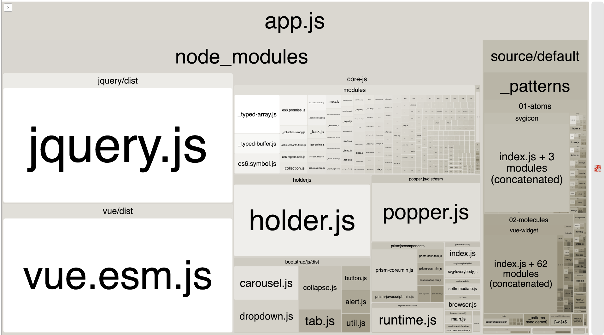

# Webpack

## Analyze your bundle

To analyze the bundle of an app, we'll generate a stats profile and then analyze it. Let's use the Pattern Lab app as an example.

First, run a full PL build \(this may take a looooong time as it uglifies the JavaScript and CSS\):

```bash
npm run build:pl
```

Then, we're going to generate a profile stats file:

```bash
NODE_ENV=production npx webpack --config apps/pl/webpack.config.js --profile --json > dist/app-pl/assets/stats.json
```

Finally, let's fire up an interactive view of our bundle:

```bash
npx webpack-bundle-analyzer dist/app-pl/assets/stats.json
```

You'll be greeted with an open browser tab featuring a visualization at [http://localhost:8888](http://localhost:8888/):



